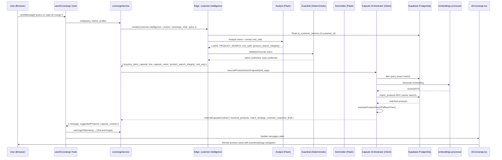

# CESARÍN OS — VOLCADO DE ARQUITECTURA TOTAL (DEEP DUMP)

**Fecha de corte:** 2026-03-22 02:00 CST  
**Versión del motor:** V3.4B-STABILIZED  
**Infraestructura:** Supabase (PostgreSQL 15 + pgvector + Edge Functions) + React 18 PWA (Vite)  
**Modelos en producción:** Gemini 2.5 Flash (Analyst + Sommelier), Gemini 2.5 Pro (Judge/QA), gemini-embedding-001 (Embeddings, 3072d)  
**Proyecto Supabase:** `cvvlorbiwtuhkxolhfie`

---

## 1. INFRAESTRUCTURA Y DATOS

### 1.1 Arquitectura de la Base de Datos

**Motor:** PostgreSQL 15 vía Supabase (cloud-hosted).  
**Extensiones activas:** `pgvector` (búsqueda vectorial), `uuid-ossp`.  
**Esquema:** Todo vive en `public`. No hay schemas de staging separados.

#### Tablas Clave que Cesarín Lee o Escribe

| Tabla | Propósito | Cesarín Consume | Cesarín Escribe |
|---|---|---|---|
| `products` | Catálogo maestro de la tienda. Contiene `name`, `slug`, `section` ('vape'│'420'), `price`, `stock`, `status`, `ai_is_featured`, `ai_sales_note`, `description`, `specs` (JSONB), `embedding` (vector 3072d). | ✅ Lectura directa (exact ilike) + RPC vectorial (`match_products`) | ❌ Solo seed/admin |
| `store_knowledge` | Base vectorial RAG. Chunks de políticas, FAQ, guías de vapeo/420. Columnas: `title`, `content`, `embedding` (vector 3072d), `category` (enum: shipping│payments│vape_basics│420_basics│policies│faq│onboarding), `source_type`, `source_id`, `is_active`. | ✅ Vía RPC `match_knowledge` | ✅ Ingesta vía edge function `knowledge-ingestor` |
| `ai_analytics` | Telemetría persistente de cada turno conversacional. Guarda `query`, `response_text`, `detected_intent`, `frustration_detected`, `recommended_product_ids`, `ai_logic_debug` (JSONB masivo con toda la cadena de decisión del Analyst→Guardrail→Sommelier). | ❌ Solo lectura por admin | ✅ Insert por cada turno (edge + client) |
| `ai_customer_memory` | Memoria persistente cross-sesión. Guarda `detected_interests` (array text), `interests_metadata` (JSONB con hits y recency), `last_interaction_at`. Upsert por `customer_id`. | ✅ Read antes de cada turno | ✅ Write después de cada turno |
| `ai_evaluations` | Juicios semánticos del modelo Juez (Pro). Scores de `tone`, `grounding`, `hallucination_detected`. | ❌ Solo admin | ✅ Write desde `cesarin-qa-judge` edge function |
| `ai_configs` | Configuración runtime del bot: nombre, `voice_tone`, `welcome_message`, `behavior_mode`. Key: `vsm-cesarin`. | ✅ Read por Sommelier | ❌ Solo admin |
| `ai_rules` | Reglas operativas inyectables. Campo `content` (text), `is_enabled`, `priority`. El Sommelier las consume ordenadas por prioridad. | ✅ Read por Sommelier | ❌ Solo admin |
| `cesarin_improvement_items` | Cola de mejora gobernada. Items trazables con `source_analytics_id`, `category`, `priority`, `status`, `operator_notes`. | ❌ Solo admin | ✅ Desde admin UI |
| `customer_intelligence_360` | Vista materializada de segmentación. Cesarín la lee para WhatsApp copy y contextualización. | ✅ Lectura selectiva | ❌ |
| `orders` | Pedidos de la tienda. Cesarín resuelve `tracking_number` y `status` para rastreo. | ✅ Read selectivo | ❌ |
| `concept_aliases` + `product_concepts` + `compatibility_relations` | Sistema de compatibilidad técnica. Mapea aliases → conceptos → relaciones. | ✅ Read para intent COMPATIBILITY_CHECK | ❌ |

#### Funciones RPC Vectoriales

| RPC | Firma | Propósito |
|---|---|---|
| `match_products` | `(query_embedding vector(3072), match_threshold float, match_count int, min_stock int default 0)` → `(id, name, slug, description, price, cover_image, section, similarity, ai_sales_note, specs)` | Búsqueda neuronal de productos por similitud coseno. Threshold por defecto: 0.4 (capsule), 0.5 (neuralSearch directo). |
| `match_knowledge` | `(query_embedding vector(3072), match_threshold float default 0.70, match_count int default 3, filter_category text default null)` → `(id, title, content, category, source_id, similarity)` | Búsqueda RAG sobre `store_knowledge`. Security definer (anon access). |

#### RLS (Row Level Security)

- `products`: RLS habilitado. Anon y authenticated pueden SELECT de productos activos.
- `store_knowledge`: RLS habilitado. Anon y authenticated pueden SELECT chunks activos (`is_active = true`). Escritura solo service role.
- `ai_analytics`: RLS habilitado. Políticas: `ai_analytics_insert_anon`, `ai_analytics_insert_authenticated` (escritura), `ai_analytics_select_admin` (lectura). El edge function escribe como service role (bypass RLS).
- `ai_customer_memory`: Upsert via service role desde edge function.

### 1.2 Cápsulas / Módulos

Las "cápsulas" son **contratos de ejecución tipados** que encapsulan una capacidad atómica del sistema de IA. Cada cápsula sigue un patrón estandarizado:

1. **Input Schema** (Zod, validado en runtime): Define qué espera recibir
2. **Evaluation Logic** (función pura, sin side-effects): Decide match strategy, confidence, draft text
3. **Output Contract** (tipado Zod estricto): Resultado estructurado con `execution_status`, `match_strategy`, productos/chunks resueltos

#### Directorio y Catálogo

| Cápsula | Schema (Zod) | Evaluador (Pure) | Orchestrator (IO Bridge) | Contrato de Salida |
|---|---|---|---|---|
| `product_search_integrity` | `src/lib/ai-capsule-schemas.ts` → `productSearchToolSchema` | `src/lib/product-search-capsule.ts` → `evaluateProductSearchFallbackTree()` | `src/services/ai-capsule-orchestrator.service.ts` → `executeProductSearchCapsule()` | `InternalCapsuleContract` |
| `knowledge_rag_foundation` | `src/lib/ai-capsule-schemas.ts` → `knowledgeToolSchema` | `src/lib/knowledge-rag-capsule.ts` → `evaluateKnowledgeRAGTree()` | `src/services/ai-capsule-orchestrator.service.ts` → `executeKnowledgeCapsule()` | `InternalKnowledgeContractType` |
| `cart_operator` | `src/lib/ai-capsule-schemas.ts` → `cartOperatorToolSchema` | `src/lib/cart-operator-capsule.ts` → `evaluateCartOperatorCapsule()` | `src/services/ai-capsule-orchestrator.service.ts` → `executeCartOperatorCapsule()` | `InternalCartOperatorContractType` |

Las cápsulas de búsqueda y conocimiento se **ejecutan en el cliente** (browser), no en el edge function. El edge function decide QUÉ cápsula activar y devuelve `requires_client_capsule: true` con los argumentos. El cliente recibe la instrucción y ejecuta localmente contra Supabase.

La cápsula de carrito (`cart_operator`) tiene un middleware de ejecución adicional: `src/lib/cart-operator-executor.ts` → `executeCartMutation()`, que traduce la propuesta de mutación del contrato puro en una operación real sobre el Zustand store (`cart.store.ts`), **rehidratando siempre el producto desde catálogo** (nunca confía en el payload del LLM para precios o metadatos).

#### Tipos Consolidados

Archivo central: `src/types/ai-capsule.ts` — Reexporta los tipos Zod inferidos.  
Schemas Zod: `src/lib/ai-capsule-schemas.ts` — Definición de los schemas de input y output para las 3 cápsulas.

---

## 2. EL MOTOR COGNITIVO (RAG & MODELOS)

### 2.1 Embeddings y Vectorización

**Modelo:** `gemini-embedding-001` (Google AI API)  
**Dimensión:** 3072 (estandarizada en migración `20260320_vector_dimensionality_reconciliation.sql`)  
**API Endpoint:** `https://generativelanguage.googleapis.com/v1/models/gemini-embedding-001:embedContent`  
**Param obligatorio:** `outputDimensionality: 3072`

#### ¿Dónde se Guarda la Base Vectorial?

**No usamos Pinecone, Weaviate, ni ningún DB vectorial externo.** Todo vive directamente en PostgreSQL vía `pgvector`:

- **`products.embedding`** — vector(3072), índice IVFFlat (lists=100), para búsqueda de productos
- **`store_knowledge.embedding`** — vector(3072), índice HNSW (m=16, ef_construction=64), para búsqueda RAG

#### Edge Functions de Embedding

| Function | Archivo | Propósito |
|---|---|---|
| `embeddings-processor` | `supabase/functions/embeddings-processor/index.ts` | Proxy simple: recibe `{ text }` → llama a Gemini → devuelve `{ embedding: number[] }`. Lo consumen los capsule orchestrators del cliente para product search y knowledge search. **NOTA:** Este edge function usa `v1beta` en su URL — tiene un drift respecto al estándar `v1` del resto del sistema. No afecta funcionalidad porque `v1beta` sigue activo, pero es un parche pendiente. |
| `knowledge-ingestor` | `supabase/functions/knowledge-ingestor/index.ts` | Ingesta masiva con chunking markdown-aware. Acciones: `ingest_single`, `ingest_text`, `update_chunk`, `delete_source`. Genera embedding por chunk e inserta en `store_knowledge`. |

#### Flujo de Búsqueda: "quiero un vape de mango"

```
1. Usuario escribe "quiero un vape de mango" en el chat
2. useAIConcierge::sendMessage() → conciergeService.chat()
3. conciergeService invoca edge function `customer-intelligence` con action='concierge_chat'
4. ANALYST (Gemini 2.5 Flash, temp=0.1) analiza y emite:
   → intent: "PRODUCT_SEARCH"
   → tool_calls: [{ name: "product_search_integrity", args: { query: "vape de mango", is_ambiguous: false, requires_semantic_expansion: false } }]
5. GUARDRAIL CHAIN evalúa y confirma intent (no override needed)
6. Edge function devuelve { requires_client_capsule: true, capsule_name: "product_search_integrity", tool_args: {...} }
7. conciergeService.chat() en el CLIENTE recibe la instrucción
8. executeProductSearchCapsule() se ejecuta en el browser:
   a) Zod valida los tool_args
   b) PARALELO: Exact match → supabase.from('products').ilike('name', '%vape de mango%')
              + Semantic match → embeddings-processor → match_products RPC (SKIP si requires_semantic_expansion=false)
   c) evaluateProductSearchFallbackTree() decide Branch C (EXACT) o Branch E (SEMANTIC)
   d) Retorna InternalCapsuleContract con resolved_products[]
9. conciergeService registra telemetría en ai_analytics
10. useAIConcierge renderiza las product cards en AIConcierge.tsx
11. Click en card → navigate(`/${product.section}/${product.slug}`) — URL canónica
12. Click en shopping bag → getProductsByIds() → addItem() al Zustand cart store
```

### 2.2 Gemini 2.5 Flash — "El Vendedor" (Sommelier)

**Archivo:** `supabase/functions/customer-intelligence/index.ts`  
**Modelo:** `gemini-2.5-flash` (constante `SOMMELIER_MODEL`)  
**API:** `https://generativelanguage.googleapis.com/v1/models/gemini-2.5-flash:generateContent`  
**Temperature:** 0.2  
**Safety Settings:** ALL `BLOCK_NONE` (tienda de productos de consumo adulto)

#### System Prompt Exacto (Composición en Runtime)

El prompt del Sommelier NO es un string estático. Se **compone dinámicamente** en cada turno con esta estructura:

```
IDENTIDAD: Eres {ai_configs.name || 'Cesarin'}. {ai_configs.voice_tone || SYSTEM_PERSONA}
MENSAJE INICIAL: {ai_configs.welcome_message}
MODO: {ai_configs.behavior_mode || 'vendedor'}

REGLAS DE COMPORTAMIENTO: {ai_rules (enabled, ordered by priority)}

POLÍTICAS OPERATIVAS: {VSM_OPERATIONAL_RULES}  ← static from persona.ts

--- CONOCIMIENTO OPERATIVO (Tools / Source of Truth) ---
POLÍTICAS: {output de get_store_policy}
PRODUCTOS ENCONTRADOS: {output de search_products}
ESTADO DE PEDIDO: {output de track_order}
PROYECCIÓN DE INVENTARIO: {output de get_inventory_outlook}
COMPATIBILIDAD: {output de check_compatibility}

--- INFORME DEL ANALISTA ---
{JSON del analystReport completo}

CLIENTE: "{query}"
HISTORIAL: {últimas 6 entradas}

{RESPONSE_FORMAT_RULES}
```

#### Persona Core (Archivo `persona.ts`)

```
SYSTEM_PERSONA: "Eres Cesar, un Sommelier robot y experto en vapeo de VSM Store. Te saludan de cariño como 'Cesarin'."
```

Las `VSM_OPERATIONAL_RULES` definen:
1. Solo recomendar del catálogo real (nunca inventar)
2. Pagos: solo transferencia/depósito
3. Envíos: solo DHL EXPRESS a SUCURSAL OCURRE
4. Sin apartados; inventario vuela
5. Soporte humano → WhatsApp
6. Featured fallback: no presentar como exacto
7. Out-of-stock: declarar agotamiento antes de alternativas
8. Proyecciones: lenguaje estimativo, cautela si señal insuficiente
9. Endurecimiento: preguntar en ambigüedad, respetar presupuesto, comparación estructurada

El `RESPONSE_FORMAT_RULES` exige output JSON estricto con `text`, `intent`, `routed_capsule`, `products`, `action`, `fallback_reason`.

### 2.3 Gemini 2.5 Pro — "El Juez" (QA Judge)

**Archivo:** `supabase/functions/cesarin-qa-judge/index.ts`  
**Modelo:** `gemini-2.5-pro` (constante `MODEL`)  
**Temperature:** 0.1  
**Modo:** POST-HOC (auditoría en segundo plano)

#### ¿Evalúa Antes o Después?

**DESPUÉS.** El Juez **no** bloquea la respuesta al usuario. No es un gate sincrónico.

Funciona así:
1. La respuesta de Cesarín se muestra al usuario inmediatamente
2. La pestaña de **Admin QA / Calidad** (`TabQuality.tsx`) permite al operador enviar scenarios o turnos completos al Juez
3. El Juez (`cesarin-qa-judge`) recibe el escenario + resultado y devuelve:
   - `tone_score` (1-10)
   - `grounding_score` (1-10)
   - `hallucination_detected` (boolean)
   - `comment` (explicación del Juez con énfasis en memoria vs intención)
4. Estos resultados se persisten en `ai_evaluations`

**Honestidad brutal:** El Juez NO evalúa automáticamente cada turno de producción. Solo se activa cuando un **operador** lo invoca manualmente desde admin, o cuando se ejecuta la suite de QA. No hay un pipeline automático de evaluación continua en background. Eso es un gap real.

### 2.4 The Analyst — "El Clasificador"

**Archivo:** `supabase/functions/customer-intelligence/index.ts` (líneas 230-298)  
**Modelo:** `gemini-2.5-flash` (constante `ANALYST_MODEL`)  
**Temperature:** 0.1

El Analyst es la primera capa de procesamiento. Es un clasificador de intención que emite:
- `intent`: CART_OPERATION | POLICY_INQUIRY | PRODUCT_SEARCH | ORDER_TRACKING | INVENTORY_OUTLOOK | CHIT_CHAT | UNKNOWN | OUT_OF_DOMAIN | COMPATIBILITY_CHECK
- `tool_calls`: Array de herramientas requeridas con argumentos
- `customer_dna`: Intereses extraídos para memoria

**Incluye 15 ejemplos Few-Shot** para estabilizar la clasificación.

**Inyección de Memoria:** Si existe `ai_customer_memory` para el `customer_id`, los intereses previos (ordenados por frecuencia/recency) se inyectan en el prompt del Analyst con la directiva: "EL DESEO ACTUAL DEL USUARIO SIEMPRE TIENE PRIORIDAD ABSOLUTA."

### 2.5 El Guardián (Guardrail Chain)

**Archivo:** `supabase/functions/customer-intelligence/index.ts` (líneas 338-411)  
**Tipo:** Determinístico (regex/keyword), NO LLM-based.

El Guardián es una cadena de **overrides determinísticos post-Analyst** que corrige errores de clasificación del LLM. Opera así:

#### ¿Qué Filtra Exactamente?

**No filtra prompts del usuario ni respuestas de Cesarín.** Su función es corregir el **routing** del intent cuando el Analyst lo clasificó mal.

#### Pipeline del Guardián

```
1. Normalizar query (NFD, remover acentos y signos)
2. Regex matching de 6 categorías:
   - isCompatibilityMatch → COMPATIBILITY_CHECK
   - isInventoryMatch → INVENTORY_OUTLOOK
   - isPolicyMatch → POLICY_INQUIRY
   - isProductMatch → PRODUCT_SEARCH
   - isGreeting → CHIT_CHAT
   - hasTimeContext → modifica alcance de compatibilidad

3. STRICT PRECEDENCE OVERRIDES:
   a) Compatibilidad SIEMPRE gana sobre búsqueda (excepto con contexto temporal)
   b) Si intent=UNKNOWN o CHIT_CHAT mal clasificado → reclasificar por regex
   c) Terminal recovery: UNKNOWN residual → PRODUCT_SEARCH (en una tienda, lo default es buscar)

4. Tool Injection:
   Si el guardrail corrigió el intent pero el Analyst no emitió la tool_call correspondiente,
   el Guardián INYECTA la tool_call canónica forzadamente.

5. Telemetría estructurada:
   Cada override queda registrado en guardrailTelemetry:
   { analyst_intent, guardrail_intent, guardrail_overrides[], injected_tools[] }
```

#### OUT_OF_DOMAIN Fast-Path

Si el intent final es `OUT_OF_DOMAIN`, el Guardián cortocircuita todo el pipeline Sommelier. Genera una respuesta genérica inmediata ("Solo puedo ayudarte con productos de nuestra tienda de vapeo y 420"), loggea la telemetría, y retorna directamente. El LLM creativo nunca se invoca.

---

## 3. AUDITORÍA DE FILOSOFÍA — MODULARIDAD TOTAL UNIDIRECCIONAL

### 3.1 Evaluación General

**La arquitectura respeta razonablemente bien el principio de flujo unidireccional.** El data flow es:

```
[Usuario] → [Hook: useAIConcierge] → [Service: conciergeService.chat()]
    → [Edge: customer-intelligence (Analyst → Guardrail → Router)]
        → returns { requires_client_capsule: true, capsule_name, tool_args }
    → [Orchestrator: ai-capsule-orchestrator.service.ts]
        → [Schema Validation: Zod]
        → [IO: Supabase queries + embeddings-processor]
        → [Pure Evaluator: product-search-capsule.ts / knowledge-rag-capsule.ts]
        → [Contract Out: InternalCapsuleContract]
    → [Hook processes contract, maps to ConciergeMessage]
    → [UI: AIConcierge.tsx renders products/knowledge/cart actions]
```

**No hay dependencias circulares** entre capsule evaluators, UI components, y los modelos.

### 3.2 Puntos Limpios

| Área | Veredicto |
|---|---|
| Separación Edge Function ↔ Client Capsule | ✅ La decisión de routing vive en cloud; la ejecución de búsqueda vive en cliente. Desacoplamiento correcto. |
| Capsule Evaluators (funciones puras) | ✅ `product-search-capsule.ts`, `knowledge-rag-capsule.ts`, `cart-operator-capsule.ts` son funciones puras sin side-effects. Testables unitariamente. |
| Cart Operator rehidratación | ✅ `cart-operator-executor.ts` NUNCA confía en precios del LLM. Siempre fetches `getProductsByIds()` antes de mutar el store. |
| UI → Store unidireccional | ✅ `AIConcierge.tsx` → `useAIConcierge` (hook) → `conciergeService` (service) → Zustand store. React tree limpio. |
| Telemetría no-blocking | ✅ Todos los `logAITelemetry()` usan `void` (fire-and-forget). Nunca bloquean la respuesta al usuario. |

### 3.3 Deudas Técnicas y Parches Temporales

| # | Descripción | Severidad | Archivo |
|---|---|---|---|
| 1 | **`embeddings-processor` usa `v1beta` en su URL** mientras todo el resto usa `v1`. No rompe nada hoy, pero es un drift que explotará cuando Google deprecia `v1beta`. | 🟡 Media | `supabase/functions/embeddings-processor/index.ts:22` |
| 2 | **`parse_admin_intent` y `generate_supplier_copy` usan `v1beta`** en sus calls a Gemini, mientras que `concierge_chat` usa `v1`. Inconsistencia de versiones API dentro del mismo edge function. | 🟡 Media | `supabase/functions/customer-intelligence/index.ts:95,123,160` |
| 3 | **Safety settings ALL `BLOCK_NONE`** en la función principal. Esto es intencional (productos de consumo adulto), pero sin documentación explícita podría ser un hallazgo de auditoría. | 🟡 Media | `supabase/functions/customer-intelligence/index.ts:32-37` |
| 4 | **El Sommelier parsea JSON con regex cleanup** (`replace(/```json/g, '').replace(/```/g, '')`). Si el modelo cambia su formato de output, el parsing falla silenciosamente e inyecta un fallback genérico. No hay retry. | 🟡 Media | `supabase/functions/customer-intelligence/index.ts:678` |
| 5 | **`TEXT GUARANTEE` inyecta "Estoy aquí para ayudarte. ¿Qué necesitas?"** como último recurso. Este es exactamente el tipo de frase que `RESPONSE_FORMAT_RULES` prohíbe explícitamente. Inconsistencia entre la garantía técnica y la regla de persona. | 🟠 Alta | `supabase/functions/customer-intelligence/index.ts:809-813` |
| 6 | **Proactive Triggers en AIConcierge usan timer de 15s** pero NO validan si el usuario ya interactuó con Cesarín. Podría generar un mensaje proactivo mientras el usuario ya está en conversación. | 🟡 Media | `src/components/ui/ai/AIConcierge.tsx:26-38` |
| 7 | **`search_products` (tool en edge) y `executeProductSearchCapsule` (capsule en client) son rutas paralelas que hacen esencialmente lo mismo.** El edge tool `search_products` se ejecuta cuando el Analyst invoca `search_products` como tool_call, pero el routing moderno siempre debería delegar a la capsule client-side `product_search_integrity`. La existencia de ambas rutas es un residuo histórico. | 🟢 Baja | `supabase/functions/customer-intelligence/tools.ts:80-155` |
| 8 | **`generate_proactive_insights` usa `v1beta` y `temperature: 0.7`** con `generation_config` (mal escrito, debería ser `generationConfig`). Potencialmente roto silenciosamente. | 🟠 Alta | `supabase/functions/customer-intelligence/index.ts:874-882` |

---

## 4. CUELLO DE BOTELLA FINAL — DESPLIEGUE EN 4 HORAS

Si me pidieran desplegar Cesarín para clientes reales ahora mismo, estos son los 3 problemas fatales:

### 🔴 ERROR FATAL 1: El Juez No Evalúa en Producción Automáticamente

El edge function `cesarin-qa-judge` existe y funciona, pero **nadie lo invoca automáticamente en cada turno de producción**. Solo se ejecuta cuando un administrador presiona un botón en la pestaña de Calidad. Esto significa que en producción:

- **No hay ningún safety net** que detecte alucinaciones en tiempo real
- Un producto inexistente recomendado por el Sommelier llegaría directo al usuario
- La frustración se detecta por heurísticas simples (escalation keywords, zero-results persistence), no por evaluación semántica real

**Impacto:** Un turno alucinado sería visible al cliente. La detección sería retrospectiva (si alguien mira los analytics manuales).

**Fix mínimo:** Implementar un background evaluation hook que envíe cada N-ésimo turno al Juez (sampling), o al menos cada turno donde `frustration_detected=true` o `zero_results=true`.

### 🔴 ERROR FATAL 2: Dependencia Directa en Google API keys y Rate Limits

Cesarín hace **mínimo 2 llamadas a Gemini por turno** (Analyst + Sommelier), y potencialmente 3-4 si involucra embeddings (Analyst + embedding + Sommelier, o Analyst + RPC + Sommelier). En caso de:

- **Rate limit (429 RESOURCE_EXHAUSTED):** El sistema muestra un error genérico con retry. No hay circuit breaker, no hay request queue, no hay fallback a un modelo secundario.
- **API key comprometida o revocada:** Todo Cesarín colapsa inmediatamente con un error 403. No hay key rotation ni fallback.
- **Latencia degradada de Gemini:** El timeout es 25 segundos (hard-coded en `useAIConcierge.ts:69`). No hay adaptive timeout.

**Impacto:** Bajo tráfico moderado (>20 conversaciones simultáneas), es probable golpear rate limits de Gemini Flash.

**Fix mínimo:** Implementar un circuit breaker con status check pre-request, y un fallback response estático cuando el circuito está abierto.

### 🔴 ERROR FATAL 3: Pilot Gate es el Único Control de Acceso

Cesarín está **gateado por una cookie de sesión** (`vsm_storefront_ai_pilot_enabled`). El flag `is_pilot: isPilotActive()` se envía al edge function, pero **el edge function no valida este flag**. No hay lógica server-side que rechace peticiones si el piloto no está activo.

Esto significa:
- Cualquier persona que setee `document.cookie = 'vsm_storefront_ai_pilot_enabled=true'` tendría acceso a Cesarín
- Si se habilita producción removiendo el gate, no hay throttling per-user ni abuse protection
- No hay CAPTCHA, no hay rate limiting per-session, no hay detección de uso abusivo

**Impacto:** En producción abierta, un actor malicioso podría abusar las API keys de Gemini vía requests directos al edge function, generando facturación no controlada.

**Fix mínimo:** Agregar validación server-side del pilot flag, o implementar rate limiting per-user/per-IP en el edge function.

---

## APÉNDICE A: MAPA DE ARCHIVOS COMPLETO DE CESARÍN

```
supabase/functions/
├── customer-intelligence/     ← Motor principal (Analyst+Sommelier+Router)
│   ├── index.ts               ← 910 líneas. Multi-action handler.
│   ├── persona.ts             ← System prompt, reglas operativas, formato respuesta
│   ├── tools.ts               ← Tool implementations (search, policy, track, inventory, compatibility)
│   └── memory.ts              ← Persistencia de intereses cross-sesión
├── cesarin-qa-judge/
│   └── index.ts               ← Juez semántico (Gemini Pro)
├── embeddings-processor/
│   └── index.ts               ← Proxy de embeddings
├── knowledge-ingestor/
│   └── index.ts               ← Ingesta y chunking de conocimiento RAG
└── inventory-oracle/
    └── index.ts               ← Proyección de agotamiento de inventario

src/
├── services/
│   ├── concierge.service.ts   ← Service layer. Chat + Semantic + Neural + Preferences
│   └── ai-capsule-orchestrator.service.ts ← Bridges: ProductSearch + Knowledge + Cart capsules
├── lib/
│   ├── ai-capsule-schemas.ts  ← Schemas Zod (input + output contracts)
│   ├── product-search-capsule.ts  ← Pure evaluator (6 branches A-F)
│   ├── knowledge-rag-capsule.ts   ← Pure evaluator (3 confidence levels)
│   ├── cart-operator-capsule.ts   ← Pure evaluator (safety + ambiguity)
│   ├── cart-operator-executor.ts  ← Middleware: contract → Zustand mutation
│   ├── pilot-activation.ts    ← Session gate (DurableCookie)
│   └── cesarin-insights.ts    ← Analytics helpers
├── hooks/
│   ├── useAIConcierge.ts      ← Main chat hook (state, send, retry, voice)
│   ├── useCesarinActivityLog.ts
│   └── useCesarinSignalStates.ts
├── components/
│   ├── ui/ai/
│   │   ├── AIConcierge.tsx    ← Chat UI bubble + product cards + knowledge chunks
│   │   └── PilotDebugBadge.tsx ← "PILOT: ACTIVE" indicator
│   └── admin/cesarin/
│       ├── TabPilot.tsx       ← Enable/disable pilot
│       ├── TabPersona.tsx     ← Persona config
│       ├── TabQuality.tsx     ← QA scenarios + Judge invocation
│       ├── TabAnalytics.tsx   ← Analytics dashboard
│       ├── TabKnowledge.tsx   ← Knowledge base management
│       ├── TabSimulator.tsx   ← Conversation simulator
│       ├── TabConcepts.tsx    ← Compatibility concepts admin
│       ├── TabImprovements.tsx ← Improvement queue
│       ├── TabInterventions.tsx ← Manual interventions
│       ├── TabRules.tsx       ← Runtime rules admin
│       ├── TabLearning.tsx    ← Memory/learning dashboard
│       ├── PilotTelemetry.tsx ← KPI cards + query log table
│       ├── PilotParityDiagnostics.tsx
│       └── ReviewDrawer.tsx   ← Turn review with evidence
├── types/
│   ├── ai-capsule.ts         ← Type re-exports
│   └── cesarin.ts            ← Cesarin-specific types
└── pages/admin/
    └── AdminCesarinOS.tsx     ← Admin layout with all tabs
```

## APÉNDICE B: FLUJO COMPLETO END-TO-END


